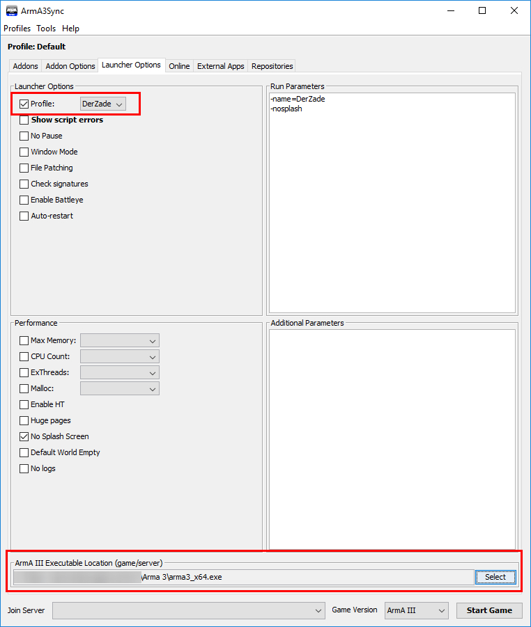
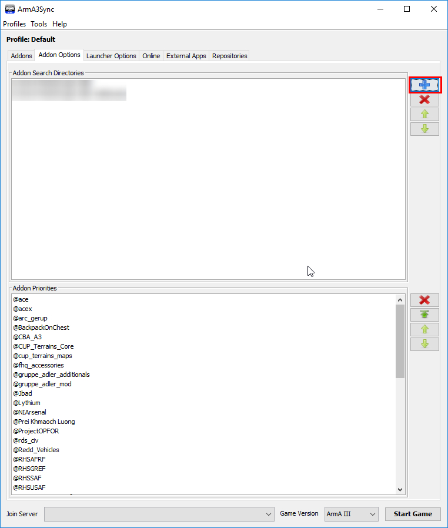
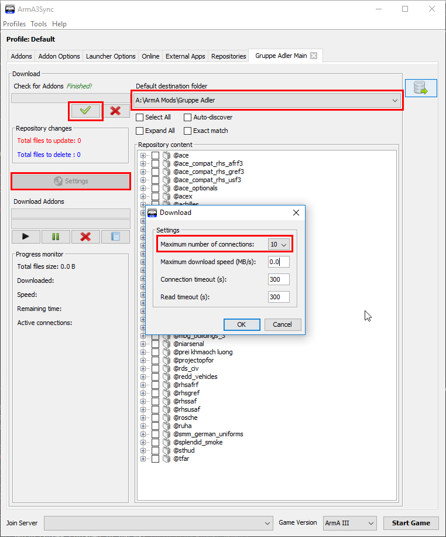

# Gruppe Adler Modset
## Einleitung
Die Gruppe Adler benutzt ein Repository (Repo) aus verschiedenen Mods um die Spielerfahrung auf unsere Bedürfnisse anzupassen.

Für die Aktualisierung verwenden wir Arma3Sync (A3S)

## Übersicht

Die Gruppe Adler benutzt im wesentlichen folgende Mods:

* Advanced Combat Environment 3 (ACE3)
* Community Upgrade Project Terrains (CUP)
* Red Hammer Studios Mods (RHS)
* Task Force Arrowhead Radio (TFAR)

Eine vollständige und detaillierte Übersicht mit allen Mods einschließlich Versionsnummern und Quellenlinks ist im Forum zu finden: [Gruppe Adler Mod-Paket Forenlink](https://forum.gruppe-adler.de/topic/361)

## Aufteilung des Repository

Unser Repository beinhalten insgesamt drei Events (oder auch im folgenden Modsets genannt). Abhängig davon, bei welchen Spieltagen teilgenommen werden soll, werden nicht alle Mods benötigt.

* **Gruppe Adler Main**: Dieses Modset enthält alle Mods die für normalen Spieltage gebraucht werden.
* **Gruppe Adler Event**: Dieses Modset ist eine Teilmenge des _Gruppe Adler Main_, enthält aber nur die absolut nötigsten Mods. Wir benutzen dieses Modsets wenn Partnerclans bei uns zu Gast sind.
* **Gruppe Adler Optionals**: Hier findest du alle optionalen Addons die du mitladen darfst, aber nicht musst. Hierbei handelt es sich ausschließlich um Addons die nur lokale Auswirkungen haben (Sound, Userinterface etc.)

## Repository anlegen und konfigurieren

### Installation Arma3Sync
Für das Herunterladen wird Arma3Sync benötigt. Die aktuelle Version ist [hier zu finden](http://www.armaholic.com/page.php?id=22199). Diese einfach herunterladen und installieren.

### Anlegen eines neuen Profils
Es ist zwar nicht unbedingt notwenig, aber empfehlenswert für jedes neues Repository ein neues Profil zu erstellen um Fehler vorzubeugen.  

Ein neues Profil lässt sich unter `Profiles` → `Edit` → `New` erstellen.  
::: grad-warn
Nachdem das neue Profil erstellt wurde sollte Arma3Sync neu gestartet werden.
:::

### Grundlegende Einstellungen

Im Tab `Launcher Options` sind die grundlegenden Einstellungen zu finden.
Hier kann alles vom Arma 3 Installations Pfad bis zu Startup Parameter konfiguriert werden.
Die Einstellungen die vorgenommen werden müssen sind:
* `Profile` - Hier das Profil mit dem gewünschten Nickname auswählen
* `Enable Battleye` - Da Battleye manchmal zu Problemen führt, da es Komponenten von Mods blockiert, kann es bei uns auf den Servern ausgeschaltet werden.
* `ArmA III Executable Location (game/server)` - Hier den Pfad zur _arma3_x64.exe_ angeben. Diese lässt sich im Installations Verzeichnis zu finden.
::: grad-tip
Das Arma Installations Verzeichnis lässt sich folgendermaßen finden:  
Steam öffnen → Rechtsklick auf Arma 3 → _Eigenschaften_ → _Lokale Dateien_ → _Lokale Dateien durchsuchen_
:::

Im Tab `Addon Options` muss nun noch ein Ordner eingestellt werden, in welchem nachher die Mods gespeichert werden. Dazu einfach rechts auf das blaue Kreuz klicken und den gewünschten Pfad auswählen.
::: grad-warn
Um Fehler zu vermeiden sollte als Verzeichnis nicht das Arma-Verzeichnis gewählt werden, da sonst Probleme mit Workshop-Mods aus Steam entstehen könnten, bei denen A3S nicht eindeutig bestimmen kann, welche Variante des Mods gepatcht bzw. geladen werden soll.

Falls die Mods dennoch im Arma-Verzeichnis liegen sollen, sollte mindestens ein Ordner _"Gruppe Adler Mods"_ im Arma-Verzeichnis erstellt und gewählt werden.
:::

### Anlegen des Repository
Ein neues Repository lässt sich im `Repository` Tab anlegen.  
Hierzu - auf der rechten Seite - auf das blaue Kreuz klicken. Im neu geöffnetem Fenster das Folgende in das Feld `Public auto-config url` eintragen:  
`http://gruppe-adler.de/arma3sync/.a3s/autoconfig`  
Danach auf `Import` drücken. Die Verbindung war erfolgreich wenn über dem Eingabefeld _Connection success!_ steht.

::: grad-tip
A3S bietet im Tab `Repositories` für alle Repositories noch folgende hilfreiche Einstellungen:
* **Notify:** A3S zeigt beim Starten an, wenn dieses Repo ein Update erhalten hat.
* **Auto:** A3S aktualisiert das Repo automatisch, sobald ein Update verfügbar ist. (Hierzu muss A3S natürlich laufen)
:::

## Repository aktualisieren

Jedes mal wenn Mods geupdatet werden müssen folgende Schritte befolgt werden um beim nächsten Spieltag ohne Probleme spielen zu können.

### Mit Repository verbinden
In der Liste der Events **(untere Liste!)** das gewünschte Event auswählen und rechts neben der Liste auf den Knopf mit dem blauen Pfeil klicken.

Ein neuer Tab mit dem gewählten Event erscheint. Hier muss unter `Default destination folder` das Verzeichnis, welches unter [Grundlegende Einstellungen](#grundlegende-einstellungen) erstellt wurde, gewählt werden.  
Mit dem Knopf mit dem grünen Haken kann die Aktualität der Mods überprüft werden. Dieser Prozess kann - gerade beim aller ersten Mal - einige Minuten dauern.

### Mods aktualisieren
Alle Mods, die mit einem gelben Warnzeichen versehen sind, müssen aktualisiert werden.  
* **Rot** - neue Mod  
* **Blau** - Mod wird gelöscht  
* **Schwarz (mit gelben Warnzeichen)** - Mod wird aktualisiert

Der Download wird mit der dem schwarzen Play Knopf gestartet.

::: grad-tip
Um eine höchst mögliche Downloadgeschwindigkeit zu gewährleisten sollte die Anzahl der maximal aktiven Verbindungen auf den maximalen Wert gestellt werden `Settings` → `Maximum number of connections`
:::

### Anlegen einer Addon Group

Als letzten Schritt muss eine sog. _Addon Group_ erstellt werden. Diese befinden sich im ersten Tab `Addons`. Mit Addon Groups lässt sich bestimmen welchen Mods mit Arma gestartet werden. Alle angehakten Mods werden mit gestartet.  
Um eine Addon Group aus einem Modset zu erstellen auf den Knopf `Modsets` drücken. In dem erschienen Fenster das gewünschte Event auswählen und mit `OK` bestätigen.

::: grad-warn
Sobald Mods zum Repository hinzukommen oder rausfliegen sollte auf jeden Fall die Addon Group neu erstellt werden. Dazu erst die alte Addon Group per Rechtsklick löschen und danach den Schritten unter [Anlegen einer Addon Group](#anlegen-einer-addon-group) folgen.
:::

### Testconnect auf Server

Ein kurzer Testconnect auf den Server, um zu überprüfen ob alles korrekt läuft, ist immer empfehlenswert. Auf unserem Standardserver ist die Adlerbase rund um die Uhr erreichbar und stets auf dem neusten Stand.

## Installation TFAR

Die Gruppe Adler benutzt Task Force Arrowhead Radio (TFAR) um eine ausreichend gute Kommunikation zu gewährleisten.  
TFAR benötigt ein Teamspeak (TS) Plugin um korrekt zu funktionieren, welches separat in TS installiert werden muss. Dazu ins Mod-Verzeichnis, welches unter [Grundlegende Einstellungen](#grundlegende-einstellungen) erstellt wurde wechseln. Im Unterverzeichnis `@tfar\teamspeak` befindet sich die Datei `task_force_radio.ts3_plugin`. Ein einfacher Doppelklick auf die Datei installiert das Plugin.

::: grad-tip
Um das Plugin zu installieren darf keine Instanz des Teamspeak 3 Clients laufen.
:::

Im TS sollte nun, wenn man den eigenen Nutzer auswählt, rechts ein Abschnitt _Task Force Radio Status_ vorhanden sein.

